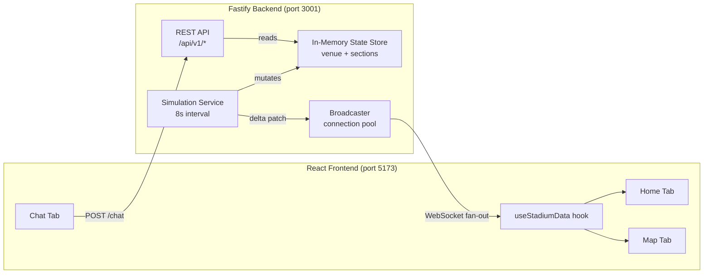

# StadiumPulse Backend — Build Walkthrough

## What was built

A complete **Node.js / Fastify** backend API tier that replaces all client-side data simulation with a real-time server-driven architecture. The frontend now connects to the backend via **WebSocket** and receives live density updates pushed every 8 seconds.

## Architecture



## Files Created / Modified

### Backend (`backend/`)

| File | Purpose |
|------|---------|
| [package.json](file:///c:/Users/HP/Pictures/Smart-venue-crowd-management-system/backend/package.json) | Dependencies: fastify, @fastify/cors, @fastify/websocket, pino-pretty |
| [server.js](file:///c:/Users/HP/Pictures/Smart-venue-crowd-management-system/backend/server.js) | Entry point — registers plugins, routes, starts simulation |
| [state/store.js](file:///c:/Users/HP/Pictures/Smart-venue-crowd-management-system/backend/state/store.js) | In-memory singleton replacing Redis + PostgreSQL |
| [services/simulation.js](file:///c:/Users/HP/Pictures/Smart-venue-crowd-management-system/backend/services/simulation.js) | 8-second interval crowd intelligence engine |
| [services/broadcaster.js](file:///c:/Users/HP/Pictures/Smart-venue-crowd-management-system/backend/services/broadcaster.js) | WebSocket connection pool + message fan-out |
| [routes/api.js](file:///c:/Users/HP/Pictures/Smart-venue-crowd-management-system/backend/routes/api.js) | REST endpoints: events, state, stats, chat, health |
| [routes/ws.js](file:///c:/Users/HP/Pictures/Smart-venue-crowd-management-system/backend/routes/ws.js) | WebSocket upgrade handler |

### Frontend (modified)

| File | Change |
|------|--------|
| [useStadiumData.js](file:///c:/Users/HP/Pictures/Smart-venue-crowd-management-system/src/hooks/useStadiumData.js) | **NEW** — WebSocket consumer hook with auto-reconnect |
| [Home.jsx](file:///c:/Users/HP/Pictures/Smart-venue-crowd-management-system/src/pages/Home.jsx) | Removed setInterval, now uses `useStadiumData` + connection indicator |
| [Map.jsx](file:///c:/Users/HP/Pictures/Smart-venue-crowd-management-system/src/pages/Map.jsx) | Removed setInterval, now uses `useStadiumData` + loading state |
| [Chat.jsx](file:///c:/Users/HP/Pictures/Smart-venue-crowd-management-system/src/pages/Chat.jsx) | Now fetches from `POST /api/v1/chat` with live state context |

## API Endpoints

| Method | Endpoint | Description |
|--------|----------|-------------|
| GET | `/api/v1/health` | Server health check |
| GET | `/api/v1/events/:id` | Event + venue metadata |
| GET | `/api/v1/events/:id/state` | Full density + wait-time snapshot |
| GET | `/api/v1/events/:id/stats` | Aggregated averages for AI context |
| POST | `/api/v1/chat` | Stadium-aware AI concierge |
| WS | `/api/v1/events/:id/live` | Real-time density delta stream |

## WebSocket Protocol

On connect, the client receives a full state snapshot:
```json
{ "type": "state_snapshot", "eventId": "evt_001", "sections": { "A": { "density": 0.82, ... } } }
```

Every 8 seconds, the client receives a delta patch:
```json
{ "type": "density_update", "eventId": "evt_001", "timestamp": 1714000000, "sections": { "A": { "density": 0.79, ... } } }
```

## Testing & Verification

### REST Endpoints — All verified via PowerShell
- `GET /health` → `{ "status": "ok" }`
- `GET /events/evt_001` → Full event + venue metadata
- `GET /events/evt_001/state` → 8 sections with live density/wait data
- `POST /chat` → Context-aware AI response using live state

### WebSocket — Verified via test-ws.js
- Initial snapshot received on connect ✓
- 3 consecutive delta updates received at 8s intervals ✓
- Connection pool cleanup on disconnect ✓

### End-to-End Browser Test
- Home tab: Live data flowing from backend, connection indicator showing "Live" ✓
- Map tab: Real-time heat map with sections colored by backend density ✓
- Chat tab: AI responses reference actual section names and wait times from backend ✓
- Alerts tab: Alerts displayed correctly ✓

## How to Run

```bash
# Terminal 1 — Backend
cd backend
npm start          # Starts on port 3001

# Terminal 2 — Frontend  
npm run dev        # Starts on port 5173
```

## Next Steps (Phase 2 → 3)

When ready to swap in Google Cloud services:
- Replace `state/store.js` with **Cloud SQL (PostgreSQL)** for persistent data
- Replace broadcaster's in-memory pools with **Memorystore (Redis)** pub/sub
- Replace mock chat responses with **Gemini API** calls using the system prompt template already built into `routes/api.js`
